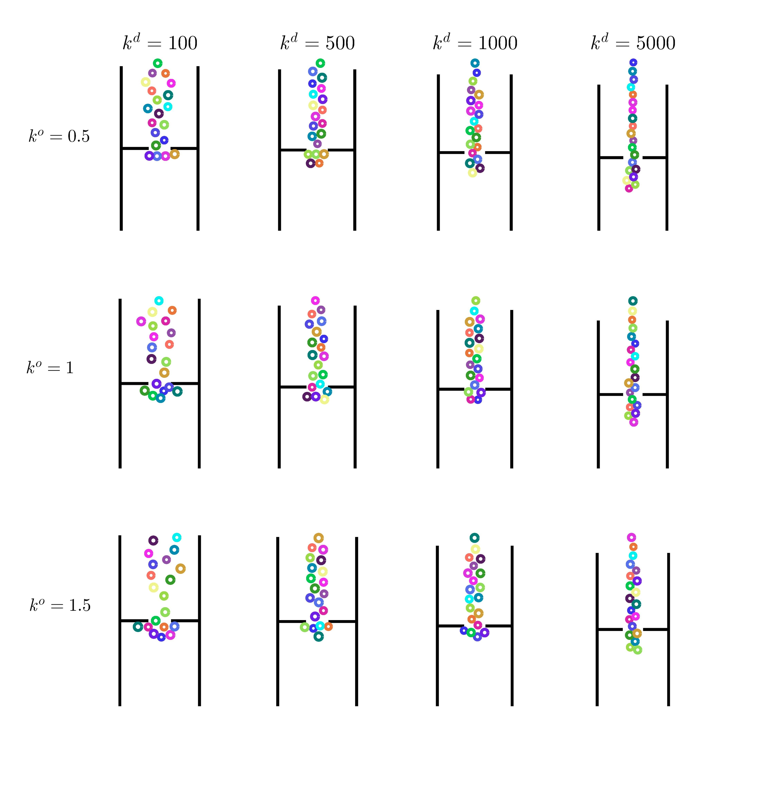

# The Headed Social Force Model

The Headed Social Force Model (HSFM) is an enhancement of the traditional Social Force Model (SFM) which explicitly accounts for the pedestrians’ heading. The motion of each individual is described by means of a dynamic model. Forces and torques driving the dynamics of each pedestrian are generated with the purpose of maximizing the realism of the resulting trajectories. In doing so, several conflicting objectives have to be taken into account. In low density scenarios, the pedestrians’ motion should be as smooth as possible, consistently with what is empirically observed. In these circumstances, lateral motions should be avoided because individuals walk ahead most of the time. On the contrary, in crowded or cluttered environments, the interaction among pedestrians, as well as between pedestrians and the environment, is stronger and determines most of the pedestrians’ trajectories. The solution proposed in the HSFM consists in computing the model inputs as suitable functions of the force terms adopted in the traditional SFM.

The Headed Social Force Model has been introduced in our recent work [Walking Ahead: The Headed Social Force Model](http://dx.doi.org/10.1371/journal.pone.0169734). You can cite that article if you this code and our model for your research.

At this time only the MATLAB implementation of the model is available. However, a Python implementation is under development.

The integration of group cohesion forces will be available in the next few days.

Web Page: https://frncscfrn.github.io/HeadedSocialForceModel/
